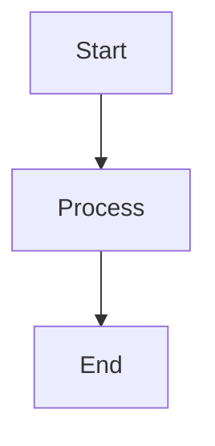

# CLAUDE.md

This file provides guidance to Claude Code (claude.ai/code) when working with code in this repository.

## Project Overview

This is an mdBook project configured with multiple preprocessors:
- **mdbook-mermaid**: Renders Mermaid diagrams in markdown
- **mdbook-autosummary**: Auto-generates SUMMARY.md based on file structure
- **mdbook-toc**: Generates table of contents within chapters

The book is titled "test" authored by Young-Gi Park.

## Common Commands

### Windows Users
For Windows PowerShell, use the `make.ps1` script:
```powershell
# If execution policy blocks the script, use:
powershell -ExecutionPolicy Bypass -Command ".\make.ps1 [command]"

# Or directly:
.\make.ps1 build
.\make.ps1 serve
```

### Unix/Linux/macOS Users
Use the Makefile with `make` command:
```bash
make build
make serve
```

### Quick Start
```bash
# Initialize mermaid support (first time only)
make init  # or: .\make.ps1 init

# Serve the book locally with live reload
make serve  # or: .\make.ps1 serve
```

### Build Commands
```bash
# Build the book
make build
# or
mdbook build

# Serve with live reload (http://localhost:3000)
make serve
# or
mdbook serve

# Build and open in browser
make open

# Clean build artifacts
make clean
# or
mdbook clean
```

### Installation
```bash
# Install all mdbook components (mdbook, mermaid, autosummary, toc)
make install  # or: .\make.ps1 install

# Install individual components
make install-mermaid      # or: .\make.ps1 install-mermaid
make install-autosummary  # or: .\make.ps1 install-autosummary
make install-toc         # or: .\make.ps1 install-toc
```

### Testing
```bash
make test
# or
mdbook test
```

## Architecture & Configuration

### Project Structure

- `book.toml` - Main configuration file defining preprocessors and build settings
- `src/` - Source directory containing all Markdown content
  - `SUMMARY.md` - Auto-generated by mdbook-autosummary (do not edit manually)
  - `index.md` files - Chapter index pages (used by autosummary)
  - Content organized in directories (e.g., `markdown/`, `mdbook/`)
- `book/` - Generated output directory (gitignored)
- `make.ps1` - PowerShell build script for Windows users
- `Makefile` - Build automation for Unix-like systems

### Preprocessor Chain

The preprocessors execute in this order (configured in `book.toml`):
1. **autosummary** - Scans `src/` directory and auto-generates `SUMMARY.md`
2. **links** - Processes internal links
3. **toc** - Adds table of contents to chapters
4. **mermaid** - Renders Mermaid diagrams

## Content Guidelines

### Adding New Content

1. **Create content files**: Add `.md` files in appropriate directories under `src/`
2. **Use index.md**: Each directory should have an `index.md` as the chapter introduction
3. **SUMMARY.md updates automatically**: The autosummary preprocessor regenerates it on build

### Mermaid Diagrams

Add Mermaid diagrams directly in markdown:

```markdown

```

### Table of Contents

Add `<!-- toc -->` in any markdown file to auto-generate a table of contents at that location.

## Scripts and Utilities

### Mermaid Processing Script

The project includes a Python script at `scripts/fix_mermaid.py` for processing Mermaid diagrams:

```bash
# Process individual Mermaid files to convert simple blocks into code + render format
python scripts/fix_mermaid.py src/93_mermaid/filename.md
```

This script:
- Converts simple `````mermaid` blocks into dual format (code example + rendered diagram)
- Removes duplicate blocks automatically  
- Uses object-oriented design with `MermaidBlock` class for better maintainability

### Content Organization

The project uses a numbered directory structure for content organization:
- `src/91_mdbook/` - mdBook documentation and tutorials
- `src/92_markdown/` - Markdown syntax and examples  
- `src/93_mermaid/` - Mermaid diagram documentation and examples

Each content directory should include an `index.md` file as the chapter introduction.

## Important Notes

- **SUMMARY.md is auto-generated** - Do not edit manually; changes will be overwritten
- **Mermaid initialization required** - Run `make init` or `.\make.ps1 init` before first use
- **Tests disabled** - `make test` is disabled for documentation projects; use `make build` to verify
- **Korean content supported** - The project includes Korean documentation alongside English content

## important-instruction-reminders
Do what has been asked; nothing more, nothing less.
NEVER create files unless they're absolutely necessary for achieving your goal.
ALWAYS prefer editing an existing file to creating a new one.
NEVER proactively create documentation files (*.md) or README files. Only create documentation files if explicitly requested by the User.