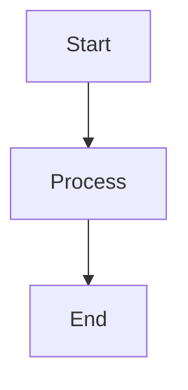

# CLAUDE.md

This file provides guidance to Claude Code (claude.ai/code) when working with code in this repository.

## Project Overview

This is an mdBook project with mdbook-mermaid support for creating books from Markdown files with Mermaid diagram capabilities. The book is titled "test" authored by Young-Gi Park.

## Common Commands

### Windows Users
For Windows PowerShell, use the `make.ps1` script:
```powershell
# If execution policy blocks the script, use:
powershell -ExecutionPolicy Bypass -Command ".\make.ps1 [command]"

# Or directly:
.\make.ps1 build
.\make.ps1 serve
```

### Unix/Linux/macOS Users
Use the Makefile with `make` command:
```bash
make build
make serve
```

### Quick Start
```bash
# Initialize mermaid support (first time only)
make init  # or: .\make.ps1 init

# Serve the book locally with live reload
make serve  # or: .\make.ps1 serve
```

### Build Commands
```bash
# Build the book
make build
# or
mdbook build

# Serve with live reload (http://localhost:3000)
make serve
# or
mdbook serve

# Build and open in browser
make open

# Clean build artifacts
make clean
# or
mdbook clean
```

### Installation
```bash
# Install both mdbook and mdbook-mermaid
make install

# Install only mdbook-mermaid
make install-mermaid
```

### Testing
```bash
make test
# or
mdbook test
```

## Project Structure

- `book.toml` - Main configuration file for the mdBook project
- `src/` - Source directory containing all Markdown content
  - `SUMMARY.md` - Defines the book's table of contents and structure
  - Chapter files (e.g., `chapter_1.md`) - Individual content chapters
- `book/` - Generated output directory (gitignored)
- `make.ps1` - PowerShell build script for Windows users
- `Makefile` - Build automation for Unix-like systems (also works on Windows with Make installed)

## Mermaid Diagram Support

This project includes mdbook-mermaid preprocessor. To add diagrams in Markdown files:

```markdown

```

The mermaid preprocessor must be initialized with `make init` or `.\make.ps1 init` before first use.