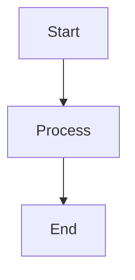

# test

An mdBook project with Mermaid diagram support.

## Quick Start

```bash
# Install dependencies
make install

# Initialize Mermaid support
make init

# Serve the book locally
make serve
```

The book will be available at http://localhost:3000

## Prerequisites

- [Rust](https://www.rust-lang.org/tools/install) (for installing mdBook via cargo)
- Make (optional, for using Makefile commands)

## Installation

### Using Make (Recommended)

```bash
# Install mdBook and mdbook-mermaid
make install

# Initialize Mermaid support
make init
```

### Manual Installation

```bash
# Install mdBook
cargo install mdbook

# Install mdbook-mermaid preprocessor
cargo install mdbook-mermaid

# Initialize Mermaid support
mdbook-mermaid install .
```

## Development

### Building the Book

```bash
make build
# or
mdbook build
```

The built book will be in the `book/` directory.

### Live Development Server

```bash
make serve
# or
mdbook serve
```

This starts a local server at http://localhost:3000 with live reload.

### Running Tests

```bash
make test
# or
mdbook test
```

### Cleaning Build Artifacts

```bash
make clean
# or
mdbook clean
```

## Project Structure

```
.
├── book.toml           # mdBook configuration
├── Makefile           # Build automation
├── src/               # Book source files
│   ├── SUMMARY.md     # Table of contents
│   └── chapter_1.md   # Chapter content
└── book/              # Generated output (gitignored)
```

## Adding Content

1. Create new markdown files in the `src/` directory
2. Add entries to `src/SUMMARY.md` to include them in the table of contents
3. Use standard Markdown syntax for content
4. Embed Mermaid diagrams using code blocks:

````markdown

````

## Available Make Commands

Run `make help` to see all available commands:

- `make install` - Install mdBook and mdbook-mermaid
- `make install-mermaid` - Install only mdbook-mermaid
- `make init` - Initialize Mermaid support
- `make build` - Build the book
- `make serve` - Serve with live reload
- `make clean` - Remove build artifacts
- `make test` - Run tests
- `make open` - Build and open in browser

## Author

Young-Gi Park

## License

[Add your license information here]