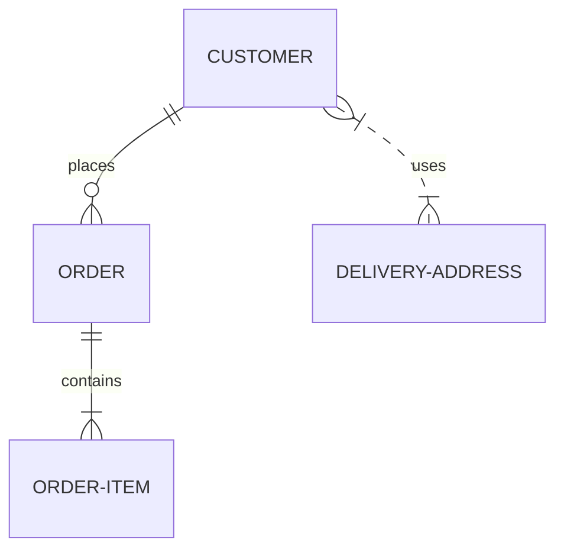
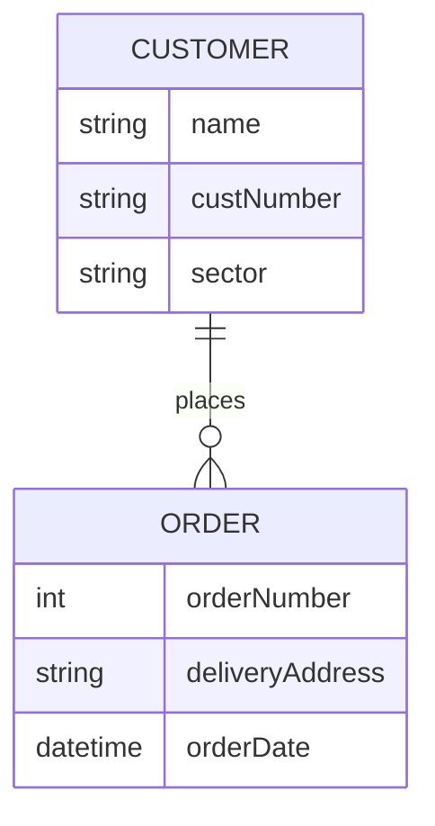
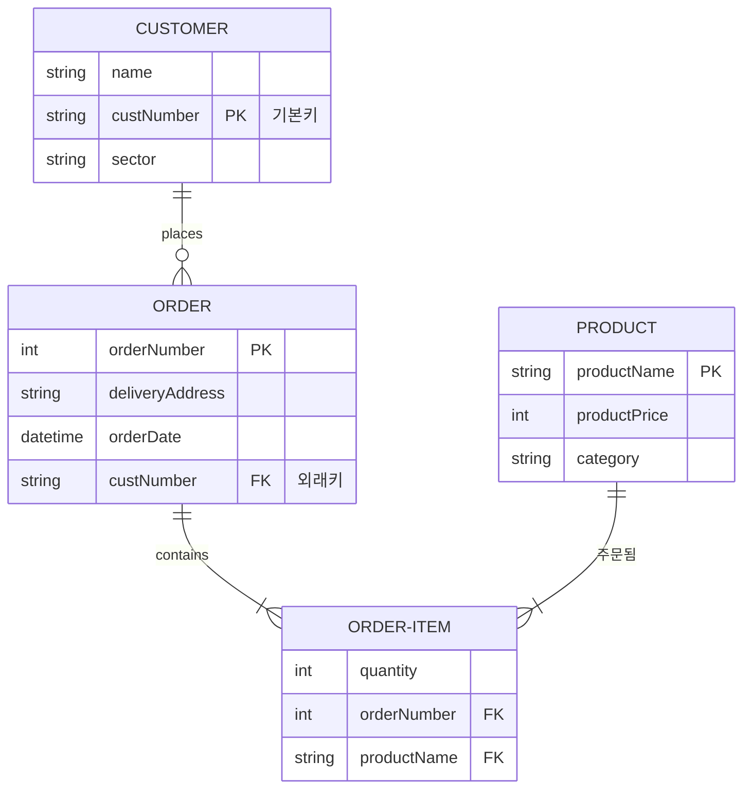
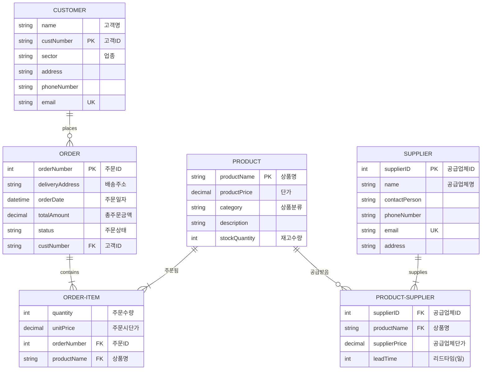
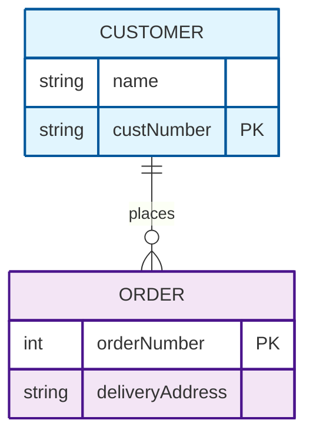
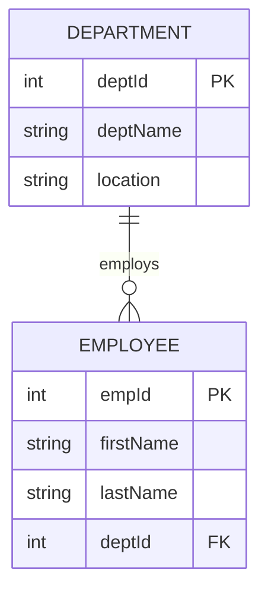
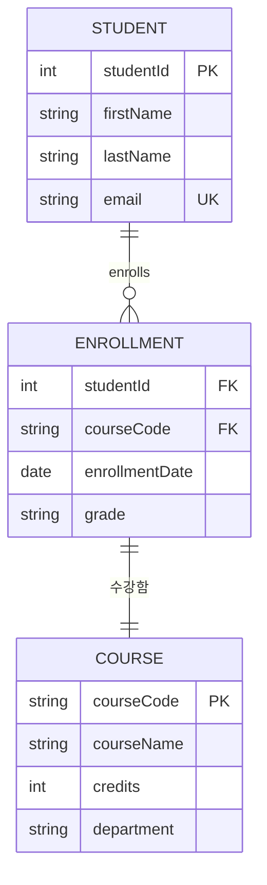
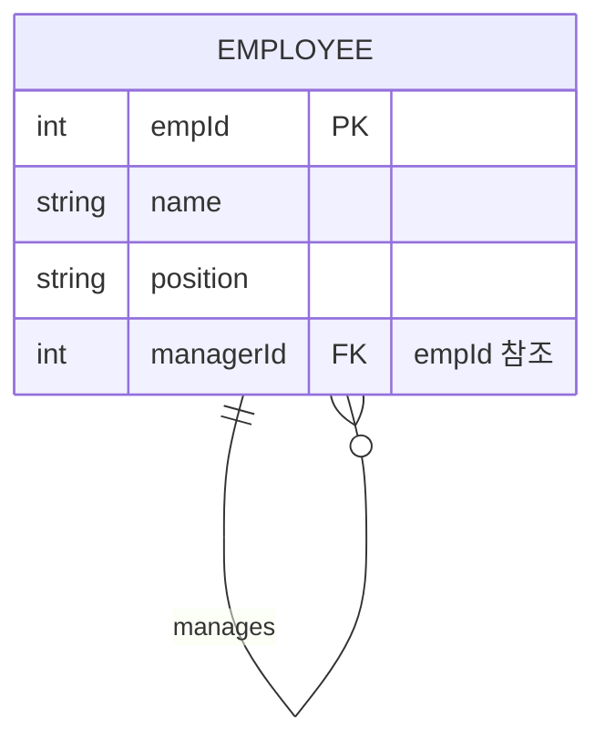
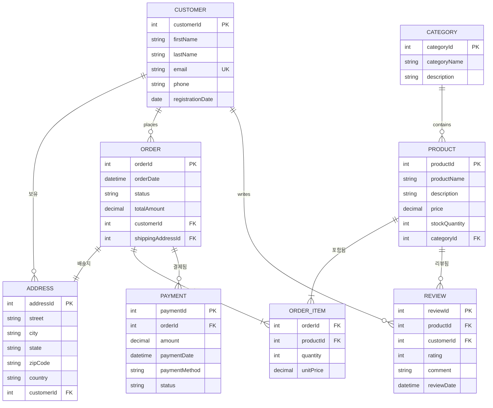

# ER 다이어그램

> 개체-관계 모델(ER 모델)은 특정 지식 영역에서 관심 있는 상호 관련된 사물들을 설명합니다. 기본적인 ER 모델은 개체 타입(관심 대상을 분류)으로 구성되며, 개체들(해당 개체 타입의 인스턴스) 간에 존재할 수 있는 관계를 명시합니다.

ER 모델링 실무자들은 거의 항상 *개체 타입*을 단순히 *개체*라고 지칭한다는 점에 주목하세요. 예를 들어 `CUSTOMER` 개체 *타입*은 단순히 `CUSTOMER` 개체라고 불립니다. 이는 매우 일반적이어서 다르게 하는 것은 바람직하지 않지만, 기술적으로 개체는 개체 타입의 추상적인 *인스턴스*이며, 이것이 ER 다이어그램이 보여주는 것입니다 - 추상적 인스턴스들과 그들 간의 관계입니다. 이것이 개체가 항상 단수 명사를 사용하여 명명되는 이유입니다.

Mermaid는 `erDiagram` 구문을 사용하여 ER 다이어그램을 렌더링할 수 있습니다.

## 문법

### 개체와 관계

Mermaid의 ER 다이어그램 문법은 PlantUML과 호환되며, 관계에 레이블을 지정하는 확장 기능이 있습니다. 각 명령문은 다음 부분들로 구성됩니다:

```text
<첫-번째-개체> [<관계> <두-번째-개체> : <관계-레이블>]
```

여기서:

- `첫-번째-개체`는 개체의 이름입니다
- `관계`는 두 개체가 서로 연관되는 방식을 설명합니다
- `두-번째-개체`는 다른 개체의 이름입니다
- `관계-레이블`은 첫 번째 개체의 관점에서 관계를 설명합니다

### 기본 예제

````text

````


## 관계 문법

`관계` 부분은 세 개의 하위 구성 요소로 나눌 수 있습니다:

- 두 번째 개체에 대한 첫 번째 개체의 카디널리티
- 관계가 '자식' 개체에게 식별성을 부여하는지 여부
- 첫 번째 개체에 대한 두 번째 개체의 카디널리티

### 카디널리티

| 값 (왼쪽) | 값 (오른쪽) | 의미         |
| --------- | ----------- | ------------ |
| `\|o`     | `o\|`       | 0개 또는 1개 |
| `\| `     | `\|\|`      | 정확히 1개   |
| `}o`      | `o{`        | 0개 이상     |
| `}\|`     | `\|{`       | 1개 이상     |

### 식별 관계

| 값   | 의미        |
| ---- | ----------- |
| `--` | 식별 관계   |
| `..` | 비식별 관계 |

## 속성

개체에 대한 속성은 개체 이름 뒤에 중괄호 `{}` 안에 속성 정의를 지정하여 정의할 수 있습니다. 각 속성은 타입과 이름으로 정의됩니다.

### 기본 속성 문법

````text

````


### 속성 키와 주석

속성을 키로 지정하고 주석을 포함할 수 있습니다:

````text

````


### 키 타입

- `PK` - 기본키(Primary Key)
- `FK` - 외래키(Foreign Key)
- `UK` - 유니크키(Unique Key)

## 완전한 예제

````text

````


## 개체명

개체명은 종종 대문자로 표기되지만, 이에 대한 공인된 표준은 없으며 Mermaid에서 필수는 아닙니다.

개체명은 다음과 같아야 합니다:

- 단수 명사
- 대문자로 작성 (일반적인 관례)
- 나타내는 것을 명확히 설명

## 스타일링

### 커스텀 스타일링

CSS를 사용하여 개별 개체를 스타일링할 수 있습니다:

````

````


## 모범 사례

### 명명 규칙

- 개체명에 단수 명사 사용
- 개체가 나타내는 것을 명확하게 식별할 수 있는 설명적인 이름 사용
- 다이어그램 전체에서 일관된 명명 패턴 유지

### 관계 설계

- 각 관계에 대해 카디널리티를 명확하게 정의
- 의미 있는 관계 레이블 사용
- 관계가 식별 관계인지 비식별 관계인지 고려

### 속성 정의

- 각 개체에 대한 모든 관련 속성 포함
- 기본키와 외래키를 명확하게 표시
- 복잡한 속성에 대해 주석 추가

## 일반적인 패턴

### 일대다 관계

````text

````


### 다대다 관계

````text

````


### 자기참조 관계

````text

````


## 복합 예제: 전자상거래 시스템

````text

````


이 포괄적인 예제는 ER 다이어그램이 여러 개체와 다양한 유형의 관계를 가진 복잡한 실세계 시스템을 어떻게 모델링할 수 있는지를 보여줍니다.

## 효과적인 ER 다이어그램 작성을 위한 팁

1. **단순하게 시작하기**: 핵심 개체와 관계부터 시작한 후 세부사항을 추가하세요
2. **명확한 이름 사용**: 개체, 속성, 관계에 대해 설명적인 이름을 선택하세요
3. **가정 문서화**: 주석을 사용하여 비즈니스 규칙과 제약 조건을 명확히 하세요
4. **이해관계자와 검증**: 도메인 전문가와 다이어그램을 검토하세요
5. **반복과 개선**: ER 다이어그램은 종종 여러 번의 수정이 필요합니다
6. **성능 고려**: 모델이 실제로 어떻게 구현될지 고려하세요
