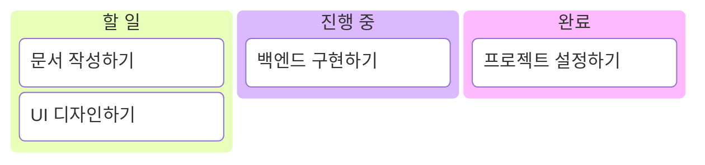
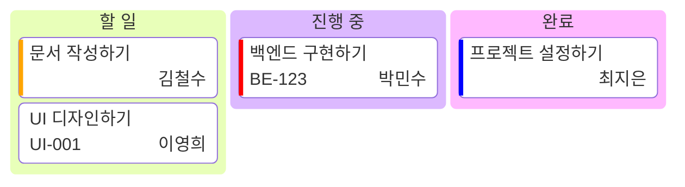
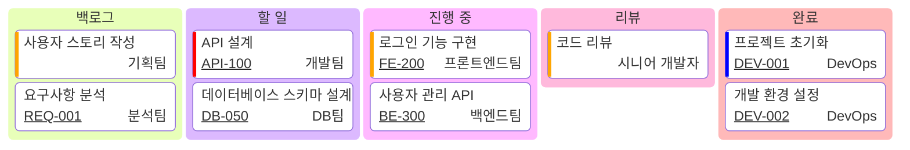
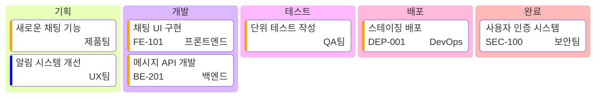
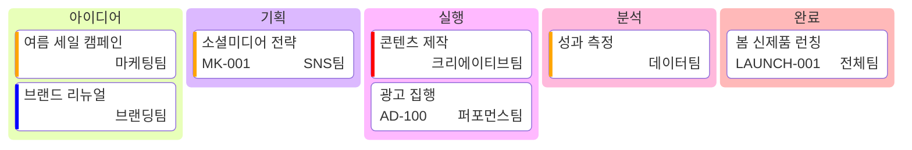

# Kanban 다이어그램

Mermaid의 Kanban 다이어그램을 사용하면 다양한 워크플로 단계를 통해 작업이 이동하는 시각적 표현을 만들 수 있습니다. 이는 프로젝트 관리와 작업 흐름을 추적하는데 매우 유용합니다.

## 개요

Kanban 다이어그램은 작업의 상태와 진행 과정을 시각적으로 보여주는 도구입니다. 각 컬럼은 작업의 단계를 나타내며, 작업들은 이러한 단계들 사이를 이동합니다.

## 기본 문법

### 컬럼 정의하기

컬럼은 워크플로 단계를 나타내며 다음과 같이 정의됩니다:

- 고유 식별자
- 대괄호 안의 컬럼 제목

문법 예제: `columnId[Column Title]`

````text

````


### 컬럼에 작업 추가하기

작업은 컬럼 아래에 다음과 같이 나열됩니다:

- 고유한 작업 식별자
- 대괄호 안의 작업 설명

문법 예제: `taskId[Task Description]`

````text

````


## 작업 메타데이터

작업에는 `@{ ... }` 문법을 사용하여 추가 메타데이터를 포함할 수 있습니다. 지원되는 키들:

- `assigned`: 작업 담당자
- `ticket`: 티켓 또는 이슈 번호 링크
- `priority`: 작업 우선순위 ('Very High', 'High', 'Low', 'Very Low')

### 메타데이터 예제



## 설정 옵션

설정 블록을 사용하여 Kanban 다이어그램을 커스터마이징할 수 있습니다:

```yaml
---
config:
  kanban:
    ticketBaseUrl: "https://yourproject.atlassian.net/browse/#TICKET#"
---
```

### 주요 설정 옵션

- `ticketBaseUrl`: 티켓 번호를 외부 시스템으로 링크할 수 있게 해주는 기본 URL

### 설정을 포함한 완전한 예제



## 실용적인 활용 예제

### 소프트웨어 개발 워크플로



### 마케팅 캠페인 관리



## 주요 특징

- **유연한 컬럼 구성**: 프로젝트에 맞게 워크플로 단계를 자유롭게 정의
- **메타데이터 지원**: 담당자, 우선순위, 티켓 정보 등을 작업에 추가
- **외부 시스템 연동**: 티켓 시스템과의 링크 지원
- **시각적 명확성**: 작업의 현재 상태를 한눈에 파악 가능

## 사용 사례

### 프로젝트 관리

- 소프트웨어 개발 프로세스 추적
- 마케팅 캠페인 진행 상황 관리
- 제품 개발 단계별 관리

### 팀 협업

- 작업 분담 및 책임자 명시
- 우선순위 기반 작업 관리
- 진행 상황 공유 및 소통

### 프로세스 시각화

- 업무 흐름 문서화
- 병목 지점 식별
- 효율성 개선 지점 발견

## 모범 사례

1. **명확한 컬럼명 사용**: 각 단계가 무엇을 의미하는지 명확히 표현
2. **일관된 메타데이터**: 모든 작업에 동일한 정보 구조 적용
3. **적절한 우선순위**: 우선순위를 명확히 설정하여 작업 순서 결정
4. **정기적 업데이트**: 작업 상태를 실시간으로 반영
5. **외부 시스템 연동**: 티켓 시스템과 연결하여 추가 정보 접근 용이성 확보

## 제한사항

- Mermaid의 Kanban 다이어그램은 정적 표현이므로 실제 드래그 앤 드롭 기능은 없습니다
- 복잡한 워크플로의 경우 여러 다이어그램으로 나누어 표현하는 것이 좋습니다
- 메타데이터 키는 정해진 형식을 따라야 합니다

Kanban 다이어그램은 프로젝트의 진행 상황을 시각적으로 추적하고 팀 간의 소통을 원활하게 하는 강력한 도구입니다. 적절히 활용하면 업무 효율성을 크게 향상시킬 수 있습니다.
