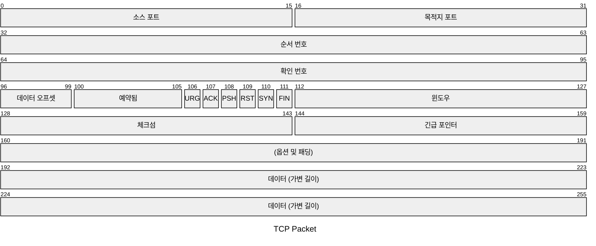
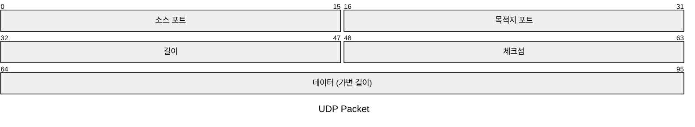

# Packet 다이어그램

Packet 다이어그램은 네트워크 패킷의 구조와 내용을 시각적으로 표현하는데 사용됩니다. 네트워크를 통해 전송되는 데이터의 기본 단위인 패킷의 구조를 명확하고 간결하게 나타낼 수 있습니다.

## 소개

Packet 다이어그램은 개발자, 네트워크 엔지니어, 교육자, 그리고 네트워크 패킷 구조를 이해해야 하는 학생들에게 특히 유용합니다. 비트 수준의 패킷 구조를 시각화하여 네트워크 프로토콜의 설계와 문서화에 도움을 줍니다.

## 기본 문법

```text
packet
start: "블록 이름" %% 단일 비트 블록
start-end: "블록 이름" %% 다중 비트 블록
... More Fields ...
```

## 비트 문법 (v11.7.0+)

시작과 끝 비트 수를 사용하는 것은 특히 설계를 수정할 때 어려울 수 있습니다. 이를 위해 이전 필드의 끝에서 자동으로 시작하는 비트 개수 필드를 추가했습니다. `+<개수>`를 사용하여 비트 수를 설정할 수 있습니다:

```text
packet
+1: "블록 이름" %% 단일 비트 블록
+8: "블록 이름" %% 8비트 블록
9-15: "시작과 끝을 수동으로 설정, 혼용 가능"
... More Fields ...
```

## 예제

코드:

```text
---
title: "TCP Packet"
---
packet
0-15: "소스 포트"
16-31: "목적지 포트"
32-63: "순서 번호"
64-95: "확인 번호"
96-99: "데이터 오프셋"
100-105: "예약됨"
106: "URG"
107: "ACK"
108: "PSH"
109: "RST"
110: "SYN"
111: "FIN"
112-127: "윈도우"
128-143: "체크섬"
144-159: "긴급 포인터"
160-191: "(옵션 및 패딩)"
192-255: "데이터 (가변 길이)"

```



코드:

```text
packet
title UDP Packet
+16: "소스 포트"
+16: "목적지 포트"
32-47: "길이"
48-63: "체크섬"
64-95: "데이터 (가변 길이)"

```



## 문법 세부사항

- **범위**: 제목 이후의 각 줄은 패킷의 서로 다른 필드를 나타냅니다. 범위(예: `0-15`)는 패킷 내의 비트 위치를 나타냅니다.
- **필드 설명**: 필드가 나타내는 내용에 대한 간단한 설명으로, 따옴표로 감쌉니다.
