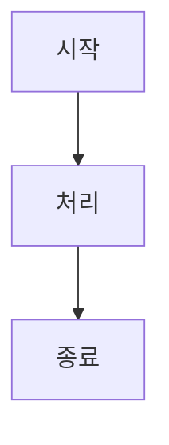

# 시작하기

<!-- toc -->

mdBook은 Markdown 파일로부터 현대적인 온라인 책을 생성하는 도구입니다. Rust로 작성되었으며, GitBook과 유사한 기능을 제공하지만 더 빠르고 가볍습니다.

## 설치

### Rust가 설치된 경우

```bash
cargo install mdbook
```

### 사전 컴파일된 바이너리 사용

1. [GitHub Releases](https://github.com/rust-lang/mdBook/releases)에서 운영체제에 맞는 바이너리 다운로드
2. PATH에 추가

### 패키지 매니저 사용

```bash
# macOS (Homebrew)
brew install mdbook

# Ubuntu/Debian
sudo apt install mdbook
```

## 기본 사용법

### 새 책 프로젝트 생성

```bash
mdbook init my-book
cd my-book
```

생성되는 기본 구조:

```
my-book/
├── book/           # 생성된 HTML 파일들
├── src/            # Markdown 소스 파일들
│   ├── SUMMARY.md  # 목차 파일
│   └── chapter_1.md
└── book.toml       # 설정 파일
```

### 책 빌드하기

```bash
# 한 번 빌드
mdbook build

# 파일 변경 시 자동 빌드 및 브라우저에서 미리보기
mdbook serve
```

`mdbook serve` 실행 후 `http://localhost:3000`에서 확인 가능합니다.

## 핵심 파일들

### SUMMARY.md - 목차 구성

`src/SUMMARY.md` 파일이 책의 구조를 정의합니다:

```markdown
# Summary

[소개](./introduction.md)

# 사용자 가이드

- [설치하기](./guide/installation.md)
- [시작하기](./guide/getting-started.md)
  - [기본 개념](./guide/getting-started/concepts.md)
  - [첫 번째 프로젝트](./guide/getting-started/first-project.md)

# 참조

- [API 문서](./reference/api.md)
- [설정](./reference/configuration.md)

---

[기여하기](./contributing.md)
[라이선스](./license.md)
```

**SUMMARY.md 문법:**

- `# 제목`: 파트(part) 구분
- `- [제목](파일경로)`: 챕터
- `    - [제목](파일경로)`: 서브챕터 (들여쓰기로 계층 구조)
- `---`: 구분선
- `[제목](파일경로)`: 번호 없는 챕터 (appendix)

### book.toml - 설정 파일

```toml
[book]
authors = ["홍길동"]
language = "ko"
multilingual = false
src = "src"
title = "내 책 제목"
description = "책에 대한 설명"

[build]
build-dir = "book"
create-missing = true

[output.html]
additional-css = ["custom.css"]
additional-js = ["custom.js"]
git-repository-url = "https://github.com/user/repo"
edit-url-template = "https://github.com/user/repo/edit/main/{path}"

[output.html.playground]
editable = true
copyable = true
copy-js = true

[output.html.search]
enable = true
limit-results = 30
teaser-word-count = 30
use-boolean-and = true
boost-title = 2
boost-hierarchy = 1
boost-paragraph = 1
expand = true
heading-split-level = 3
copy-js = true
```

## 주요 기능

### 1. 코드 블록 강화

````markdown
```rust,editable
fn main() {
    println!("Hello, World!");
}
```

```bash,ignore
# 실행되지 않는 코드 블록
$ some-command
```

```rust,no_run
// 컴파일만 하고 실행하지 않음
fn main() {
    panic!("This won't run");
}
```
````

### 2. 수학 공식 지원

MathJax를 활성화하면 LaTeX 수식을 사용할 수 있습니다:

```toml
[output.html]
mathjax-support = true
```

```markdown
인라인 수식: \\( e^{i\pi} + 1 = 0 \\)

블록 수식:
\\[ \sum_{i=1}^{n} i = \frac{n(n+1)}{2} \\]
```

### 3. 테마 커스터마이징

```toml
[output.html]
default-theme = "navy"
preferred-dark-theme = "navy"
theme = "my-theme"
```

사용 가능한 기본 테마:

- `light` (기본값)
- `rust`
- `coal`
- `navy`
- `ayu`

### 4. 플러그인과 전처리기

```toml
[preprocessor.links]
# 링크 전처리기 (기본 활성화)

[preprocessor.index]
# 인덱스 전처리기

[preprocessor.mermaid]
command = "mdbook-mermaid"

[output.html.playground]
runnable = true
```

## 고급 기능

### 템플릿과 변수

템플릿 변수 사용:

```markdown
이 책의 제목은 {{title}}입니다.
저자: {{author}}
```

### 조건부 렌더링

```toml
[preprocessor.template]
```

```markdown
{{#if output.html}}
HTML 출력용 내용
{{/if}}

{{#if output.pdf}}
PDF 출력용 내용
{{/if}}
```

### 다국어 지원

```toml
[book]
language = "ko"

[output.html]
additional-css = ["korean.css"]
```

## 배포

### GitHub Pages

1. `.github/workflows/deploy.yml` 생성:

```yaml
name: Deploy mdBook
on:
  push:
    branches: [main]
  pull_request:
    branches: [main]

jobs:
  deploy:
    runs-on: ubuntu-latest
    steps:
      - uses: actions/checkout@v2
      - name: Install mdBook
        run: |
          curl -L https://github.com/rust-lang/mdBook/releases/download/v0.4.21/mdbook-v0.4.21-x86_64-unknown-linux-gnu.tar.gz | tar xz
          echo "./mdbook" >> $GITHUB_PATH
      - name: Build book
        run: mdbook build
      - name: Deploy to GitHub Pages
        uses: peaceiris/actions-gh-pages@v3
        with:
          github_token: ${{ secrets.GITHUB_TOKEN }}
          publish_dir: ./book
```

2. GitHub 리포지토리 Settings > Pages에서 소스를 "GitHub Actions"로 설정

### Netlify

1. 사이트 루트에 `netlify.toml` 생성:

```toml
[build]
  publish = "book"
  command = "mdbook build"

[build.environment]
  RUST_VERSION = "1.70.0"

[[plugins]]
  package = "netlify-plugin-rust"
```

## 팁과 모범 사례

### 1. 파일 구조 조직화

```
src/
├── SUMMARY.md
├── introduction.md
├── part1/
│   ├── README.md
│   ├── chapter1.md
│   └── chapter2.md
├── part2/
│   ├── README.md
│   └── advanced.md
└── appendix/
    ├── glossary.md
    └── resources.md
```

### 2. 이미지 관리

```
src/
├── images/
│   ├── diagram1.png
│   └── screenshot.jpg
└── chapter1.md
```

```markdown

```

### 3. 상호 참조

```markdown
[설치 가이드](./installation.md)를 참고하세요.
[API 문서의 함수 목록](./api.md#functions) 섹션을 확인하세요.
```

### 4. 검색 최적화

- 각 페이지에 적절한 제목 사용
- 목차에서 의미 있는 챕터 제목 작성
- 중요한 키워드를 본문에 포함

## 확장 도구

### mdbook-mermaid

다이어그램 지원:

```bash
cargo install mdbook-mermaid
```

````markdown

````

````

### mdbook-toc
자동 목차 생성:

```bash
cargo install mdbook-toc
````

### mdbook-pdf

PDF 출력:

```bash
cargo install mdbook-pdf
```

## 문제 해결

### 자주 발생하는 오류

1. **파일을 찾을 수 없음**: SUMMARY.md에서 참조한 파일이 실제로 존재하는지 확인
2. **빌드 실패**: `book.toml` 문법 오류 확인
3. **이미지가 표시되지 않음**: 이미지 경로가 `src/` 폴더 기준으로 올바른지 확인
4. **수식이 렌더링되지 않음**: `book.toml`에서 MathJax 지원 활성화 확인

### 디버깅

```bash
# 자세한 출력으로 빌드
mdbook build --log-level debug

# 특정 포트로 서버 실행
mdbook serve --port 8080 --hostname 0.0.0.0
```

## SUMMARY.md 자동 생성

mdBook 자체에는 SUMMARY.md 자동 생성 기능이 없지만, 여러 서드파티 도구를 사용할 수 있습니다:

### 1. mdbook-autosummary

디렉토리 구조를 기반으로 SUMMARY.md를 자동 생성합니다.

```bash
cargo install mdbook-autosummary
```

**book.toml 설정:**

```toml
[preprocessor.autosummary]
# mdBook이 삭제된 폴더를 다시 생성하지 않도록 설정
[build]
create-missing = false
```

**디렉토리 구조 예시:**

```
src/
├── index.md
├── chapter_1.md
├── chapter_2.md
├── foo/
│   ├── index.md
│   ├── chapter_3.md
│   └── chapter_4.md
└── bar/
    ├── index.md
    ├── chapter_5.md
    └── chapter_6.md
```

**자동 생성되는 SUMMARY.md:**

```markdown
<!-- Generated by mdbook-autosummary - do not edit manually! -->

[Home](index.md)
[Chapter 1](chapter_1.md)
[Chapter 2](chapter_2.md)

- [Section Foo](foo/index.md)
  - [Chapter 3](foo/chapter_3.md)
  - [Chapter 4](foo/chapter_4.md)
- [Section Bar](bar/index.md)
  - [Chapter 5](bar/chapter_5.md)
  - [Chapter 6](bar/chapter_6.md)
```

**주의사항:**

- 모든 폴더에 `index.md` 파일이 있어야 함
- 각 파일은 `# 제목`으로 시작해야 함 (제목으로 사용됨)
- 첫 번째 전처리기로 실행되어야 함

### 2. mdbook-auto-gen-summary

CLI 도구와 전처리기 두 가지 방식으로 사용 가능합니다.

```bash
cargo install mdbook-auto-gen-summary
```

**CLI 사용:**

```bash
# 파일명을 제목으로 사용
mdbook-auto-gen-summary gen /path/to/your/mdbook/src

# 첫 번째 줄을 제목으로 사용
mdbook-auto-gen-summary gen -t /path/to/your/mdbook/src
```

**전처리기로 사용:**

```toml
[preprocessor.auto-gen-summary]
first-line-as-link-text = true
```

### 3. 수동 스크립트 작성

간단한 Python/Bash 스크립트로 직접 구현할 수도 있습니다:

```python
#!/usr/bin/env python3
import os
import re

def generate_summary(src_path):
    summary = ["# Summary\n\n"]

    for root, dirs, files in os.walk(src_path):
        # SUMMARY.md는 제외
        md_files = [f for f in files if f.endswith('.md') and f != 'SUMMARY.md']

        for file in sorted(md_files):
            file_path = os.path.join(root, file)
            relative_path = os.path.relpath(file_path, src_path)

            # 파일의 첫 번째 # 제목 추출
            title = extract_title(file_path) or file.replace('.md', '')

            # 들여쓰기 계산 (폴더 깊이에 따라)
            depth = relative_path.count(os.sep)
            indent = "  " * depth

            summary.append(f"{indent}- [{title}]({relative_path})\n")

    return "".join(summary)

def extract_title(file_path):
    with open(file_path, 'r', encoding='utf-8') as f:
        for line in f:
            match = re.match(r'^#\s+(.+)', line.strip())
            if match:
                return match.group(1)
    return None

# 사용 예
if __name__ == "__main__":
    summary_content = generate_summary("src")
    with open("src/SUMMARY.md", "w", encoding='utf-8') as f:
        f.write(summary_content)
```

### 추천 방법

**mdbook-autosummary**를 추천합니다:

- 가장 활발히 유지보수됨
- 디렉토리 구조를 직관적으로 반영
- 전처리기로 동작하여 자동 갱신
- 설정이 간단함

### 사용 시 주의점

1. **SUMMARY.md를 .gitignore에 추가**하는 것을 권장
2. **파일 구조를 잘 정리**해야 의미 있는 목차가 생성됨
3. **각 폴더에 index.md** 파일 필요 (섹션 제목용)
4. **파일명을 의미 있게** 작성 (정렬 순서에 영향)

## 결론

mdBook은 기술 문서, 튜토리얼, API 문서 등을 작성하기에 훌륭한 도구입니다. Markdown의 간편함과 현대적인 웹 인터페이스를 결합하여 읽기 쉽고 탐색하기 편한 문서를 만들 수 있습니다. SUMMARY.md 자동 생성 도구들을 활용하면 대규모 문서도 효율적으로 관리할 수 있습니다.

추가 정보는 [공식 mdBook 가이드](https://rust-lang.github.io/mdBook/)를 참고하세요.
