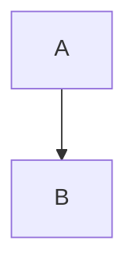
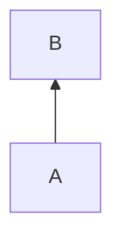
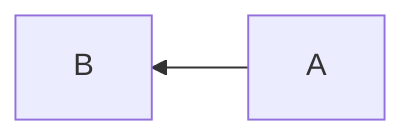
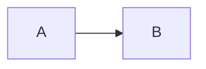
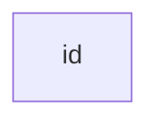

# 플로우차트 (Flowchart)

## 플로우차트란?

모든 플로우차트는 **노드**(기하학적 도형)와 **간선**(화살표 또는 선)으로 구성됩니다. Mermaid 코드는 이러한 노드와 간선이 만들어지고 연결되는 방식을 정의합니다.

아래 예제를 실행하려면 코드를 편집기에 붙여넣거나, [Mermaid Live Editor](https://mermaid.live/)를 사용해보세요.

## 기본 문법

### 방향

먼저 플로우차트의 방향을 선언할 수 있습니다.

`flowchart` 또는 `graph`를 사용할 수 있습니다. 권장 사항은 차트를 통해 명시적으로 구분하기 위해 `flowchart`를 사용하는 것입니다.

#### 위에서 아래로 (TB - Top to Bottom 또는 TD - Top Down)

````

````


#### 아래에서 위로 (BT - Bottom to Top)

````

````


#### 오른쪽에서 왼쪽으로 (RL - Right to Left)

````

````


#### 왼쪽에서 오른쪽으로 (LR - Left to Right)

````

````


## 노드(Nodes)

### 기본 노드

````

````


> **참고**: id는 박스에 표시되는 것이며, 플로우차트의 각 노드에 대한 고유한 식별자 역할을 합니다.

### 텍스트가 있는 노드

노드 id와 다른 텍스트를 설정할 수도 있습니다. 텍스트를 대괄호 안에 넣으면 됩니다.

````

````


### 유니코드 텍스트

Markdown 문자열을 사용하려면 텍스트를 큰따옴표로 묶어야 합니다.

````

````


### Markdown 포맷

Markdown 포맷을 사용하여 텍스트를 강조할 수 있습니다.

````

````


## 노드 모양

### 둥근 모서리가 있는 노드

````

````


### 스타디움 모양 노드

````

````


### 서브루틴 모양 노드

````
```mermaid
flowchart LR
    id1[[이것은 서브루틴 모양의 박스 안 텍스트입니다]]
```
````

```mermaid
flowchart LR
    id1[[이것은 서브루틴 모양의 박스 안 텍스트입니다]]
```
### 원통형 노드

````
```mermaid
flowchart LR
    id1[(데이터베이스)]
```
````

```mermaid
flowchart LR
    id1[(데이터베이스)]
```
### 원형 노드

````
```mermaid
flowchart LR
    id1((이것은 원 안의 텍스트입니다))
```
````

```mermaid
flowchart LR
    id1((이것은 원 안의 텍스트입니다))
```
### 비대칭 모양 노드

````
```mermaid
flowchart LR
    id1>이것은 박스 안의 텍스트입니다]
```
````

```mermaid
flowchart LR
    id1>이것은 박스 안의 텍스트입니다]
```
### 마름모 노드

````
```mermaid
flowchart LR
    id1{이것은 마름모 안의 텍스트입니다}
```
````

```mermaid
flowchart LR
    id1{이것은 마름모 안의 텍스트입니다}
```
### 육각형 노드

````
```mermaid
flowchart LR
    id1{{이것은 육각형 노드입니다}}
```
````

```mermaid
flowchart LR
    id1{{이것은 육각형 노드입니다}}
```
### 평행사변형

````
```mermaid
flowchart TD
    id1[/이것은 평행사변형입니다/]
```
````

```mermaid
flowchart TD
    id1[/이것은 평행사변형입니다/]
```
### 평행사변형 대체

````
```mermaid
flowchart TD
    id1[\이것은 평행사변형 대체입니다\]
```
````

```mermaid
flowchart TD
    id1[\이것은 평행사변형 대체입니다\]
```
### 사다리꼴

````
```mermaid
flowchart TD
    A[/사다리꼴\]
```
````

```mermaid
flowchart TD
    A[/사다리꼴\]
```
### 사다리꼴 대체

````
```mermaid
flowchart TD
    B[\역 사다리꼴/]
```
````

```mermaid
flowchart TD
    B[\역 사다리꼴/]
```
### 이중 원

````
```mermaid
flowchart TD
    id1(((이것은 이중 원입니다)))
```
````

```mermaid
flowchart TD
    id1(((이것은 이중 원입니다)))
```
## 링크(Links)

노드는 링크/간선으로 연결할 수 있습니다. 링크 유형과 두께를 다르게 설정할 수 있습니다.

### 화살표가 있는 링크

````
```mermaid
flowchart LR
    A --> B
```
````

```mermaid
flowchart LR
    A --> B
```
### 열린 링크

````
```mermaid
flowchart LR
    A --- B
```
````

```mermaid
flowchart LR
    A --- B
```
### 링크 위의 텍스트

````
```mermaid
flowchart LR
    A-- 이것은 텍스트입니다 ---B
```
````

```mermaid
flowchart LR
    A-- 이것은 텍스트입니다 ---B
```
또는:

````
```mermaid
flowchart LR
    A---|이것은 텍스트입니다|B
```
````

```mermaid
flowchart LR
    A---|이것은 텍스트입니다|B
```
### 화살표와 텍스트가 있는 링크

````
```mermaid
flowchart LR
    A-->|텍스트|B
```
````

```mermaid
flowchart LR
    A-->|텍스트|B
```
또는:

````
```mermaid
flowchart LR
    A-- 텍스트 -->B
```
````

```mermaid
flowchart LR
    A-- 텍스트 -->B
```
### 점선 링크

````
```mermaid
flowchart LR
    A-.->B
```
````

```mermaid
flowchart LR
    A-.->B
```
### 텍스트가 있는 점선 링크

````
```mermaid
flowchart LR
    A-. 텍스트 .->B
```
````

```mermaid
flowchart LR
    A-. 텍스트 .->B
```
### 두꺼운 링크

````
```mermaid
flowchart LR
    A ==> B
```
````

```mermaid
flowchart LR
    A ==> B
```
### 텍스트가 있는 두꺼운 링크

````
```mermaid
flowchart LR
    A == 텍스트 ==> B
```
````

```mermaid
flowchart LR
    A == 텍스트 ==> B
```
### 보이지 않는 링크

````
```mermaid
flowchart LR
    A ~~~ B
```
````

```mermaid
flowchart LR
    A ~~~ B
```
### 링크 체이닝

동일한 줄에서 여러 링크를 선언할 수 있습니다:

````
```mermaid
flowchart LR
    A -- 텍스트 --> B -- 텍스트2 --> C
```
````

```mermaid
flowchart LR
    A -- 텍스트 --> B -- 텍스트2 --> C
```
여러 노드 링크를 동일한 줄에서 선언할 수도 있습니다:

````
```mermaid
flowchart LR
    a --> b & c--> d
```
````

```mermaid
flowchart LR
    a --> b & c--> d
```
다음과 같이 매우 복잡한 다이어그램을 표현할 수 있습니다:

````
```mermaid
flowchart TB
    A & B--> C & D
```
````

```mermaid
flowchart TB
    A & B--> C & D
```
## 새로운 화살표 유형

Mermaid는 다음과 같은 새로운 화살표 유형을 지원합니다:

### 원형 간선

````
```mermaid
flowchart LR
    A --o B
```
````

```mermaid
flowchart LR
    A --o B
```
### 교차 간선

````
```mermaid
flowchart LR
    A --x B
```
````

```mermaid
flowchart LR
    A --x B
```
### 다방향 화살표

````
```mermaid
flowchart LR
    A o--o B
    B <--> C
    C x--x D
```
````

```mermaid
flowchart LR
    A o--o B
    B <--> C
    C x--x D
```
## 링크의 최소 길이

플로우차트에서 각 노드는 결과 다이어그램에서 렌더링될 때 특정 순위가 지정됩니다. 순위 기반으로 레이아웃 엔진이 플로우차트 노드를 그릴 위치를 결정합니다.

기본적으로 링크는 시작 노드와 종료 노드 사이의 간격을 1 순위 차이로 만듭니다:

````
```mermaid
flowchart TD
    A[시작] --> B{예 또는 아니오?}
    B -->|예| C[좋습니다!]
    C --> D[생각해보기]
    D --> B
    B ---->|아니오| E[끝]
```
````

```mermaid
flowchart TD
    A[시작] --> B{예 또는 아니오?}
    B -->|예| C[좋습니다!]
    C --> D[생각해보기]
    D --> B
    B ---->|아니오| E[끝]
```
링크 정의에 대시를 더 추가하여 링크를 더 길게 만들 수 있습니다:

````
```mermaid
flowchart TD
    A[시작] --> B{예 또는 아니오?}
    B -->|예| C[좋습니다!]
    C --> D[생각해보기]
    D --> B
    B ---->|아니오| E[끝]
```
````

```mermaid
flowchart TD
    A[시작] --> B{예 또는 아니오?}
    B -->|예| C[좋습니다!]
    C --> D[생각해보기]
    D --> B
    B ---->|아니오| E[끝]
```
## 특수 문자

특수 문자를 포함해야 하는 텍스트를 렌더링할 때, 문법과 충돌할 수 있습니다. 따옴표 안에 텍스트를 넣어 이를 회피할 수 있습니다.

````
```mermaid
flowchart LR
    id1["이것은 # 기호가 있는 텍스트입니다"]
```
````

```mermaid
flowchart LR
    id1["이것은 # 기호가 있는 텍스트입니다"]
```
### 이스케이프 문자

특수 문자를 이스케이프하려면 백슬래시를 사용할 수 있습니다:

````
```mermaid
flowchart LR
    A["따옴표 내 따옴표: \"#9829;\""] --> B["백슬래시: \\"]
```
````

```mermaid
flowchart LR
    A["따옴표 내 따옴표: \"#9829;\""] --> B["백슬래시: \\"]
```
## 서브그래프(Subgraphs)

서브그래프를 사용하여 그래프를 구조화할 수 있습니다:

````
```mermaid
flowchart TB
    subgraph one
        a1 --> a2
    end
    subgraph two
        b1 --> b2
    end
    subgraph three
        c1 --> c2
    end
    one --> two
    three --> two
    two --> c2
```
````

```mermaid
flowchart TB
    subgraph one
        a1 --> a2
    end
    subgraph two
        b1 --> b2
    end
    subgraph three
        c1 --> c2
    end
    one --> two
    three --> two
    two --> c2
```
### 서브그래프 중첩

서브그래프를 서로 중첩시킬 수 있습니다:

````
```mermaid
flowchart TB
    subgraph 상위
        subgraph 하위1
            a1 --> a2
        end
        subgraph 하위2
            b1 --> b2
        end
    end
```
````

```mermaid
flowchart TB
    subgraph 상위
        subgraph 하위1
            a1 --> a2
        end
        subgraph 하위2
            b1 --> b2
        end
    end
```
### 서브그래프 방향 설정

`direction` 키워드를 사용하여 서브그래프의 방향을 설정할 수 있습니다:

````
```mermaid
flowchart LR
    subgraph TOP
        direction TB
        subgraph B1
            direction RL
            i1 --> i2
        end
        subgraph B2
            direction BT
            i3 --> i4
        end
    end
    A --> TOP --> B
```
````

```mermaid
flowchart LR
    subgraph TOP
        direction TB
        subgraph B1
            direction RL
            i1 --> i2
        end
        subgraph B2
            direction BT
            i3 --> i4
        end
    end
    A --> TOP --> B
```
## 상호작용(Interaction)

노드에 클릭 이벤트를 바인딩할 수 있습니다:

````
```mermaid
flowchart LR
    A --> B
    click A "http://www.github.com" "이것은 툴팁입니다"
```
````

```mermaid
flowchart LR
    A --> B
    click A "http://www.github.com" "이것은 툴팁입니다"
```
자바스크립트 콜백도 가능합니다:

````
```mermaid
flowchart LR
    A --> B
    click A callback "툴팁"
```
````

```mermaid
flowchart LR
    A --> B
    click A callback "툴팁"
```
## 스타일링

### 노드 스타일

특정 노드에 스타일을 적용할 수 있습니다:

````
```mermaid
flowchart LR
    id1(시작) --> id2(정지)
    style id1 fill:#f9f,stroke:#333,stroke-width:4px
    style id2 fill:#bbf,stroke:#f66,stroke-width:2px,stroke-dasharray: 5 5
```
````

```mermaid
flowchart LR
    id1(시작) --> id2(정지)
    style id1 fill:#f9f,stroke:#333,stroke-width:4px
    style id2 fill:#bbf,stroke:#f66,stroke-width:2px,stroke-dasharray: 5 5
```
### 클래스

클래스를 정의하고 노드에 적용할 수 있습니다:

````
```mermaid
flowchart LR
    A:::someclass --> B
    classDef someclass fill:#f96
```
````

```mermaid
flowchart LR
    A:::someclass --> B
    classDef someclass fill:#f96
```
여러 클래스를 정의할 수도 있습니다:

````
```mermaid
flowchart LR
    A:::foo & B:::bar --> C:::foobar
    classDef foo stroke:#f00
    classDef bar stroke:#0f0
    classDef foobar stroke:#00f
```
````

```mermaid
flowchart LR
    A:::foo & B:::bar --> C:::foobar
    classDef foo stroke:#f00
    classDef bar stroke:#0f0
    classDef foobar stroke:#00f
```
### 기본 클래스

`default`라는 특별한 클래스를 사용하여 명시적 클래스가 없는 모든 노드에 스타일을 적용할 수 있습니다:

````
```mermaid
flowchart LR
    A --> B --> C
    classDef default fill:#f96
```
````

```mermaid
flowchart LR
    A --> B --> C
    classDef default fill:#f96
```
## 주석

주석은 `%%`로 시작하여 줄바꿈까지 이어집니다:

````
```mermaid
flowchart LR
%% 이것은 주석입니다
    A -- 텍스트 --> B{노드}
    A --> C(둥근 노드)
    B --> D{마름모}
    C --> D
```
````

```mermaid
flowchart LR
%% 이것은 주석입니다
    A -- 텍스트 --> B{노드}
    A --> C(둥근 노드)
    B --> D{마름모}
    C --> D
```
## 구성(Configuration)

### 렌더러

플로우차트는 기본 레이아웃 알고리즘으로 dagre 래퍼를 사용합니다.

복잡하고 큰 다이어그램의 경우 elk 렌더러가 더 나은 레이아웃과 성능을 제공할 수 있습니다:

````
```mermaid
%%{init: {"flowchart": {"defaultRenderer": "elk"}} }%%
flowchart TB
    a --> b
    b --> c
    c --> d
```
````

```mermaid
%%{init: {"flowchart": {"defaultRenderer": "elk"}} }%%
flowchart TB
    a --> b
    b --> c
    c --> d
```
### 너비

너비를 조정하여 각 순위에 렌더링되는 노드 수를 정의할 수 있습니다:

````
```mermaid
%%{init: {"flowchart": {"width": 100%}} }%%
flowchart TD
    A[크리스마스] --> B{선물을 받으러 가자}
```
````

```mermaid
%%{init: {"flowchart": {"width": 100%}} }%%
flowchart TD
    A[크리스마스] --> B{선물을 받으러 가자}
```
## 마무리

Mermaid의 플로우차트는 간단한 텍스트 기반 구문으로 복잡한 다이어그램을 만들 수 있는 강력한 도구입니다. 노드 모양, 링크 스타일, 서브그래프, 스타일링 등 다양한 기능을 활용하여 명확하고 이해하기 쉬운 플로우차트를 만들 수 있습니다.

더 자세한 내용은 [Mermaid 공식 문서](https://mermaid.js.org/)를 참조하세요.
