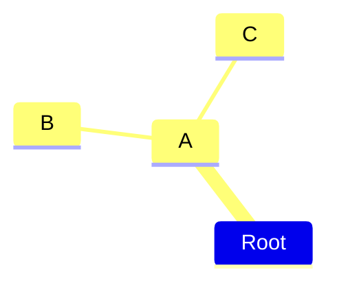
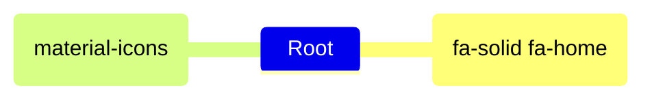
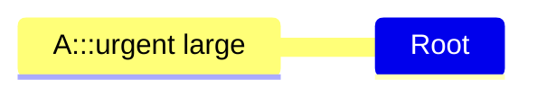

# Mindmap 구문 및 예제

## 개요

> 마인드맵은 정보를 계층적으로 시각적으로 구성하여 전체의 부분들 간의 관계를 보여주는 다이어그램입니다.

## 기본 구문

마인드맵 구문은 간단하며 들여쓰기를 사용하여 계층 구조를 정의합니다:

````

````


### 주요 특징

- 들여쓰기가 노드 레벨을 결정합니다
- 첫 번째 노드가 루트입니다
- 자식 노드는 부모보다 더 깊게 들여쓰기됩니다

## 노드 모양

Mermaid는 여러 노드 모양을 지원합니다:

### 사용 가능한 모양
- 사각형
- 둥근 사각형
- 원형
- 뱅
- 구름
- 육각형
- 기본값

## 고급 기능

### 아이콘
`::icon()` 구문을 사용하여 노드에 아이콘을 추가할 수 있습니다:

````

````


### 클래스
트리플 콜론을 사용하여 사용자 정의 클래스를 적용할 수 있습니다:

````

````


## 마크다운 문자열

텍스트 서식을 지원합니다:
- `**`로 볼드 텍스트
- `*`로 이탤릭
- 자동 텍스트 줄바꿈

## 통합

버전 9.4.0부터 마인드맵을 쉽게 통합할 수 있습니다:

```html
<script type="module">
  import mermaid from 'https://cdn.jsdelivr.net/npm/mermaid@11/dist/mermaid.esm.min.mjs';
</script>
```

## 참고사항

> 이것은 실험적인 다이어그램입니다. 구문과 속성은 향후 릴리스에서 변경될 수 있습니다.