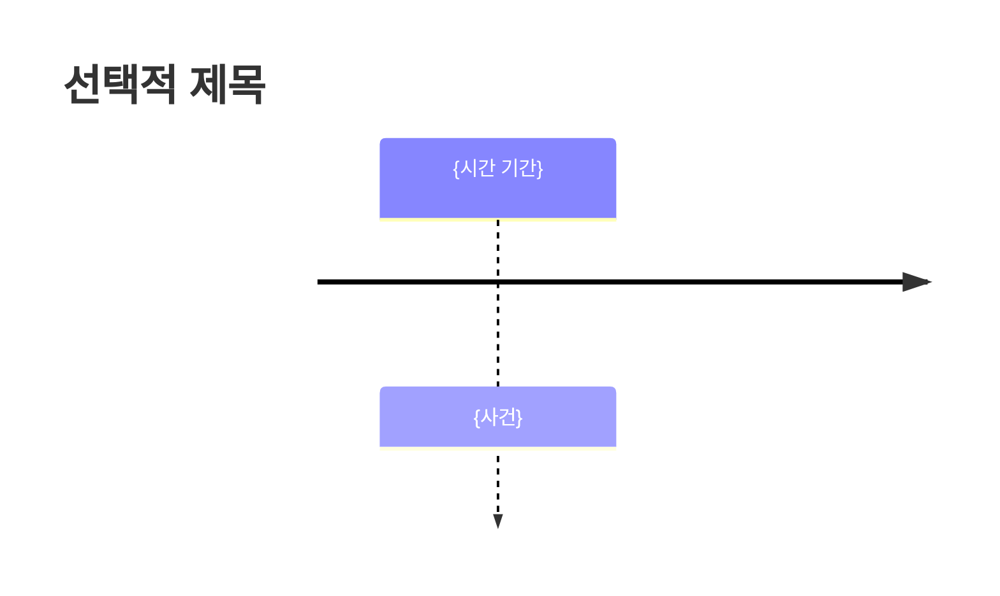
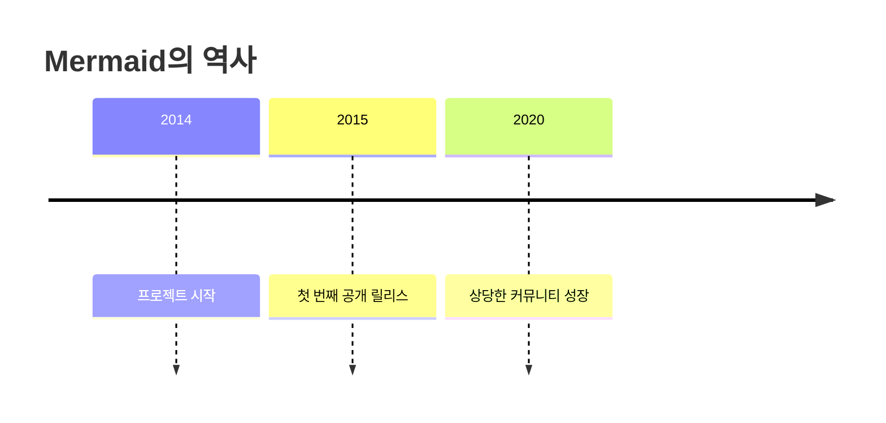
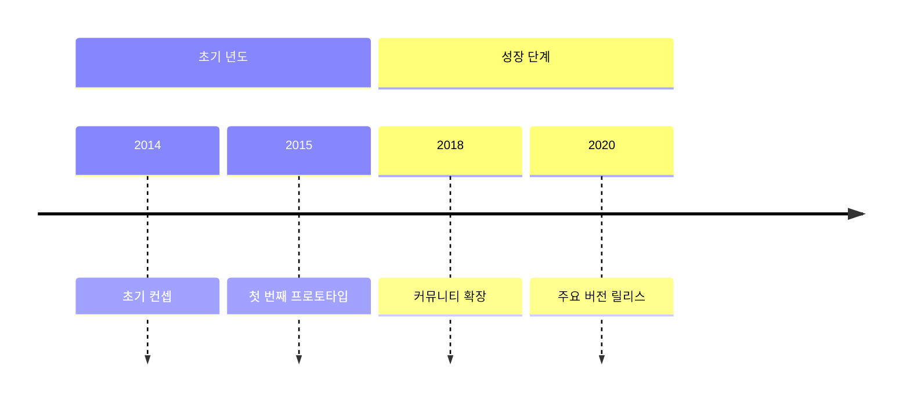

# 타임라인 다이어그램

## 개요

타임라인 다이어그램은 사건이나 기간을 시간순으로 그래픽으로 표현한 것입니다. 문서에 설명된 바와 같이, 이는 "사건, 날짜 또는 시간 기간의 연대기를 보여주며" 사건들 간의 관계를 나타낼 수 있습니다.

## 기본 구문

타임라인 다이어그램을 만드는 기본 구문은 `timeline` 키워드로 시작합니다:

````

````


### 주요 구문 규칙

- `timeline` 키워드로 시작
- `title`을 사용하여 선택적 제목 추가 가능
- 시간 기간과 사건은 단순한 텍스트
- 시간 기간당 여러 사건 추가 가능

## 예제 구문

````

````


## 고급 기능

### 섹션/시대

시간 기간을 섹션으로 그룹화할 수 있습니다:

````

````


### 텍스트 줄바꿈

- 긴 기간이나 사건의 경우 텍스트가 자동으로 줄바꿈됩니다
- 강제 줄바꿈을 위해 `<br>` 사용 가능

## 스타일링 옵션

- 각 시간 기간에 대한 기본 다색 모드
- `disableMultiColor`를 사용하여 다색 비활성화 옵션
- 테마 변수를 사용한 사용자 정의 색상 구성표

## 테마

지원되는 테마:
- base
- forest
- dark
- default
- neutral

## 통합

모듈 임포트를 사용하여 웹 페이지에 통합할 수 있습니다:

```html
<script type="module">
  import mermaid from 'https://cdn.jsdelivr.net/npm/mermaid@11/dist/mermaid.esm.min.mjs';
</script>
```

**참고**: 이것은 실험적인 기능이며, 구문이 향후 릴리스에서 변경될 수 있습니다.