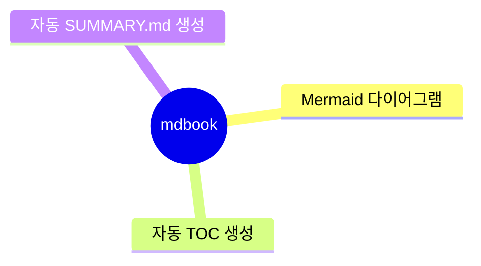
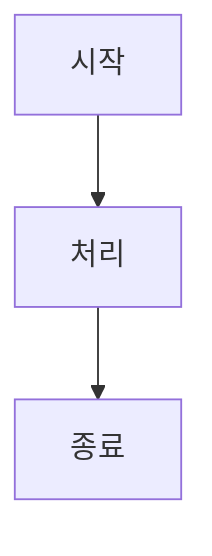

# MDBOOK BoilerPlate

mdBook 프로젝트를 위한 보일러플레이트입니다.

Mermaid 다이어그램, 자동 목차 생성, TOC 지원이 포함되어 있습니다.



## 주요 기능

- **mdbook-mermaid**: 마크다운에서 Mermaid 다이어그램 렌더링
- **mdbook-autosummary**: 파일 구조를 기반으로 SUMMARY.md 자동 생성
- **mdbook-toc**: 챕터 내 목차 자동 생성
- **다국어 지원**: 한국어 및 영어 콘텐츠 지원
- **유틸리티 스크립트**: 콘텐츠 처리를 위한 Python 스크립트 포함

## 빠른 시작

### 사전 준비

- [Rust](https://www.rust-lang.org/tools/install) (mdBook을 cargo로 설치하기 위해 필요)

### 설치 및 실행

```bash
# 의존성 설치
make install

# Mermaid 지원 초기화
make init

# 로컬에서 책 서버 실행
make serve
```

책은 http://localhost:3000 에서 확인할 수 있습니다.

### Windows 사용자

PowerShell에서 다음과 같이 실행하세요:

```powershell
# 실행 정책이 차단된 경우:
powershell -ExecutionPolicy Bypass -Command ".\make.ps1 install"
powershell -ExecutionPolicy Bypass -Command ".\make.ps1 init"
powershell -ExecutionPolicy Bypass -Command ".\make.ps1 serve"

# 또는 직접:
.\make.ps1 install
.\make.ps1 init
.\make.ps1 serve
```

## 사용 가능한 명령어

### 기본 명령어

```bash
make build          # 책 빌드
make serve          # 라이브 리로드로 서버 실행
make dev            # serve와 동일
make clean          # 빌드 결과물 정리
make open           # 빌드 후 브라우저에서 열기
```

### 설치 관련

```bash
make install              # 모든 mdbook 컴포넌트 설치
make install-mermaid      # mdbook-mermaid만 설치
make install-autosummary  # mdbook-autosummary만 설치
make install-toc          # mdbook-toc만 설치
make init                 # Mermaid 지원 초기화
```

### 도움말

```bash
make help            # 사용 가능한 명령어 목록 보기
make completions     # 셸 자동완성 설정 방법 보기
```

## 프로젝트 구조

```
.
├── book.toml                 # mdBook 설정 파일
├── Makefile                  # Unix/Linux/macOS용 빌드 자동화
├── make.ps1                  # Windows PowerShell용 빌드 스크립트
├── CLAUDE.md                 # Claude Code를 위한 프로젝트 가이드
├── scripts/                  # Python 유틸리티 스크립트
│   ├── fix_mermaid.py       # Mermaid 다이어그램 처리
│   ├── toggle-autosummary.py # autosummary 토글
│   └── number_headings.py   # 제목 번호 매기기
├── src/                     # 책 소스 파일
│   ├── SUMMARY.md          # 목차 (자동 생성됨)
│   ├── index.md            # 메인 페이지
│   ├── 01_mdbook_official/ # 공식 mdBook 문서
│   ├── 91_mdbook/          # mdBook 문서 및 튜토리얼 (한국어)
│   ├── 92_markdown/        # 마크다운 문법 및 예제
│   └── 93_mermaid/         # Mermaid 다이어그램 문서 및 예제
└── book/                   # 생성된 출력물 (gitignored)
```

## 콘텐츠 추가하기

1. `src/` 디렉터리에 새로운 마크다운 파일을 생성합니다
2. 각 디렉터리에 `index.md` 파일을 챕터 소개로 포함합니다
3. `SUMMARY.md`는 autosummary에 의해 자동으로 업데이트됩니다
4. 표준 마크다운 문법을 사용하여 콘텐츠를 작성합니다

### Mermaid 다이어그램 추가

````markdown

````

### 목차 추가

마크다운 파일의 원하는 위치에 `<!-- toc -->`를 추가하면 해당 위치에 자동으로 목차가 생성됩니다.

## 유틸리티 스크립트

### Mermaid 처리

```bash
# Mermaid 블록을 코드 예제 + 렌더링 형식으로 변환
python scripts/fix_mermaid.py src/93_mermaid/filename.md
```

### 기타 스크립트

```bash
# autosummary 토글
python scripts/toggle-autosummary.py

# 제목 번호 매기기
python scripts/number_headings.py
```

## 중요한 참고사항

- **SUMMARY.md는 자동 생성됨**: 수동으로 편집하지 마세요. 변경사항이 덮어쓰여집니다
- **Mermaid 초기화 필요**: 처음 사용하기 전에 `make init` 또는 `.\make.ps1 init`를 실행하세요
- **테스트 비활성화됨**: 문서 프로젝트의 경우 테스트가 비활성화되어 있습니다. `make build`를 사용하여 확인하세요

## 작성자

Young-Gi Park

## 라이센스

[라이센스 정보를 여기에 추가하세요]
